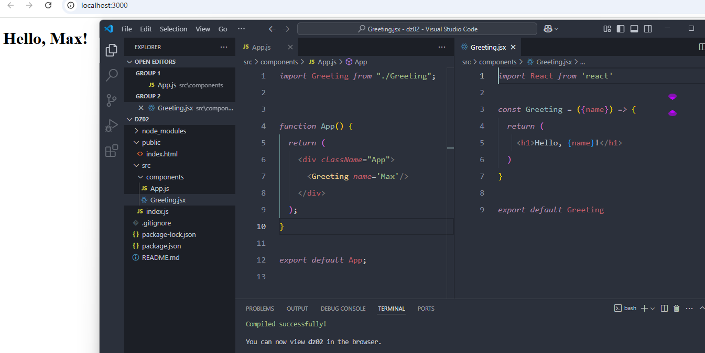
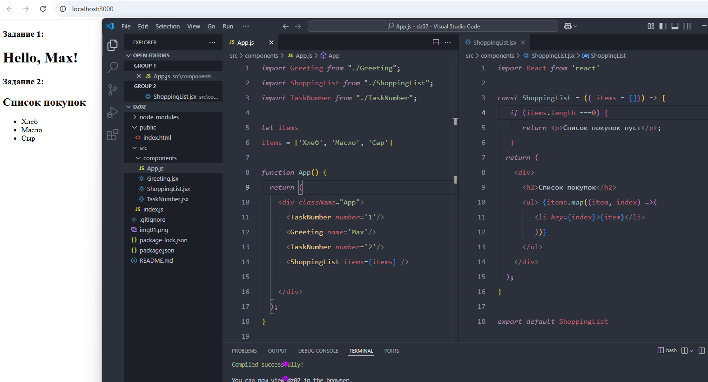
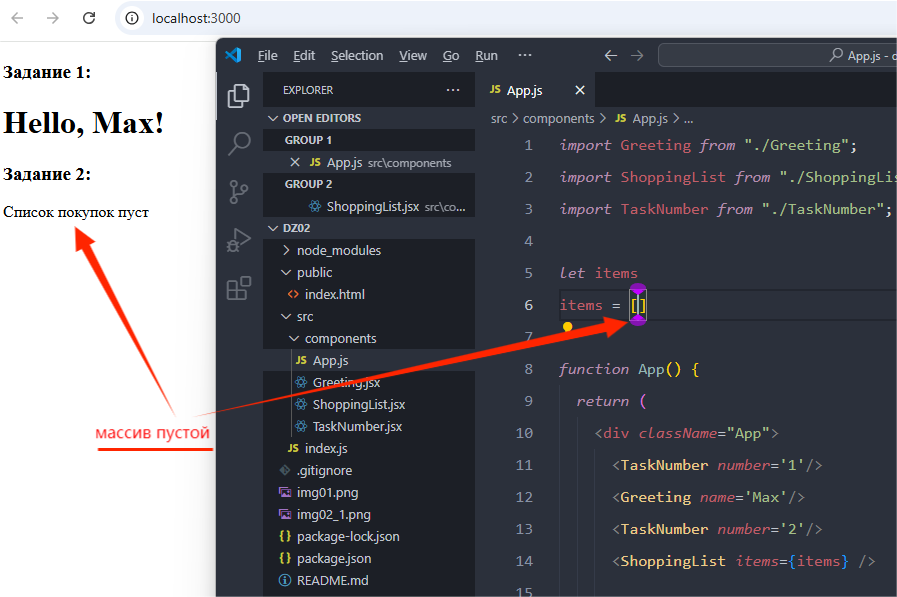
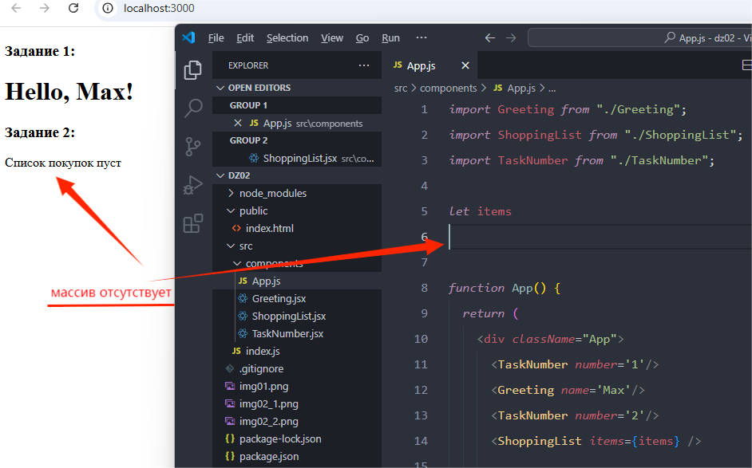
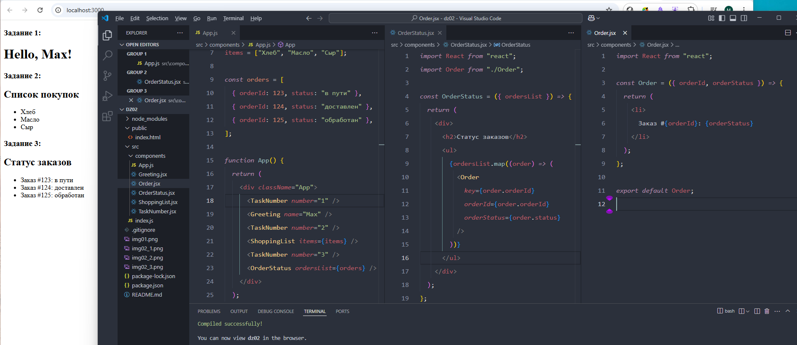

# React домашнее задание 2

## Задание 1: Создание компонента Приветствия

1. Создайте новый проект React при помощи `create-react-app`.

2. Подготовьте проект к работе.

3. Создайте функциональный компонент с именем Greeting

4. Этот компонент должен принимать проп name, после чего выводить приветственное сообщение в формате: `"Привет, [name]!"`, где `[name]` — это значение переданного пропа.

5. Импортируйте компонент в App для его отображения.

6. Запустите программу, проверьте работоспособность. 

## Задание 2: Компонент Списка Покупок

1. В компоненте App определите массив, содержащий названия любых товаров.

2. Создайте компонент ShoppingList.

3. Компонент должен принимать массив с названиями товаров через проп items.

4. Также ShoppingList должен отображать каждый элемент из массива в виде `<li>` элемента `<ul>` списка.

5. Если массив пуст, должно отображаться сообщение: "Список покупок пуст".

6. Импортируйте ShoppingList в App, запустите приложение.

7. Проверьте, выводится ли сообщение, если список покупок пуст.

## Задание 3: Компонент Статуса Заказа

1. В компоненте App определите массив, содержащий информацию о заказах в формате `[{orderId: 123, status: ‘в пути’}]`.

2. Создайте компонент OrderStatus который принимает два пропа: `orderId` (номер заказа) и `status` (статус заказа, например, "обработан", "в пути", "доставлен").

3. Компонент должен отображать информацию в следующем формате: `"Заказ #[orderId]: [status]"`.

4. Импортируйте компонент в App, проверьте его работоспособность.

