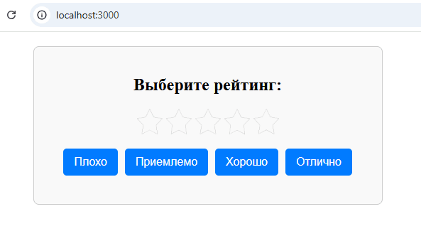
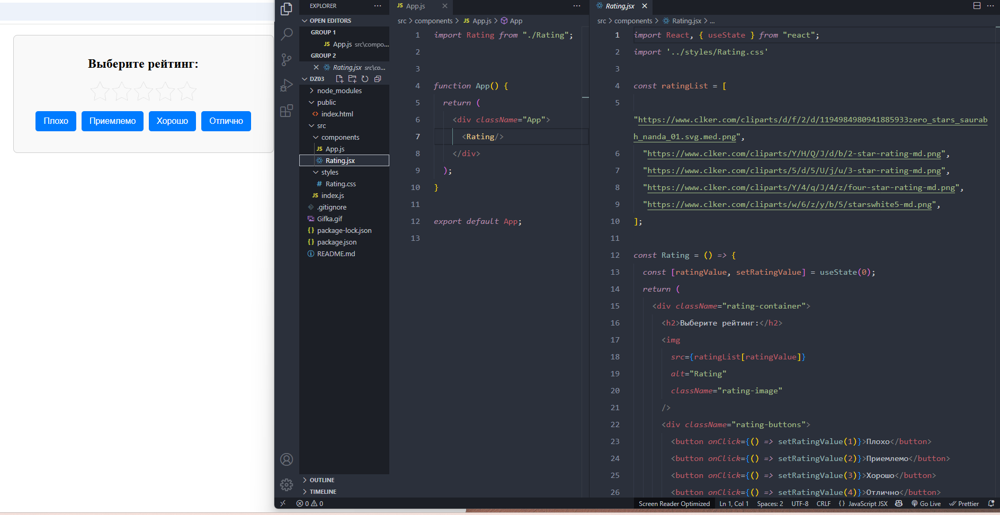
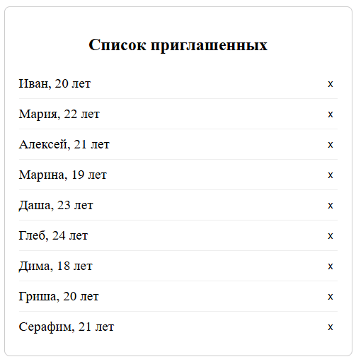
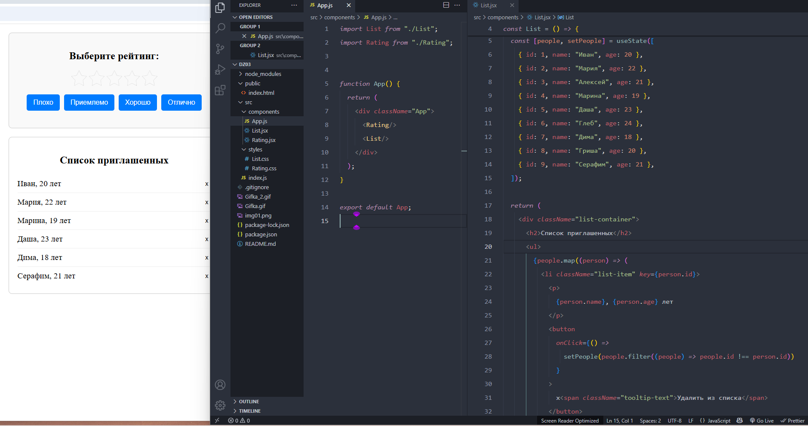

# React домашнее задание 3

## Задание 1: Создадим простое приложение с возможностью менять рейтинг.

1. Создайте новый файл Rating.jsx.

2. Внутри файла Rating.jsx импортируйте useState из React.

3. Создайте функциональный компонент Rating.

4. Внутри компонента Rating используйте useState для создания состояния ratingValue, начальное значение которого будет равно 0.

5. Определите массив ratingList, содержащий ссылки на изображения для разных значений рейтинга.

6. Верните JSX в компоненте Rating, который будет содержать:

	- Изображение текущего рейтинга из массива ratingList.

	-  Кнопки с различными значениями рейтинга (например, "Плохо", "Приемлемо", "Хорошо", "Отлично").

7. Для каждой кнопки установите обработчик события onClick, который будет обновлять состояние ratingValue в соответствии с выбранным значением рейтинга.

8. Внутри компонента Rating определите возвращаемый JSX так, чтобы изображение рейтинга и кнопки располагались внутри контейнера `
`.

9. В файле App.js импортируйте компонент Rating из файла Rating.jsx.

10. В компоненте App используйте компонент Rating.

11. Стилизуйте приложение на ваш вкус: задайте цвет и размер кнопкам, задайте размер изображениям и т.п.

12. Запустите ваше React-приложение и убедитесь, что компонент Rating отображается и работает корректно, позволяя пользователю выбирать разные значения рейтинга. 

## Задание 2: Компонент "Список приглашенных"

1. Создайте новый компонент List.jsx.

2. Внутри него импортируйте useState из React.

3. Внутри компонента List используйте useState для создания состояния people, начальное значение которого будет массивом объектов людей с их именами и возрастами.

4. Верните JSX в компоненте List, который будет содержать:

	- Список для отображения людей.

	- Каждый элемент списка будет содержать имя и возраст человека.

	- Для каждого элемента в списке предусмотрите кнопку удаления.

5. Добавьте обработчик события для кнопки удаления студента, который будет обновлять состояние people, удаляя соответствующего человека из списка.

6. Внутри компонента List определите возвращаемый JSX так, чтобы список с информацией о людях и кнопками удаления располагался внутри контейнера `
`.

7. Создайте файл App.js.

8. В файле App.js импортируйте компонент List из файла List.jsx.

9. В компоненте App используйте компонент List.

10. Стилизуйте приложение на ваше усмотрение

11. Запустите ваше React-приложение и убедитесь, что компонент List отображается и позволяет пользователю удалять студентов из списка.

