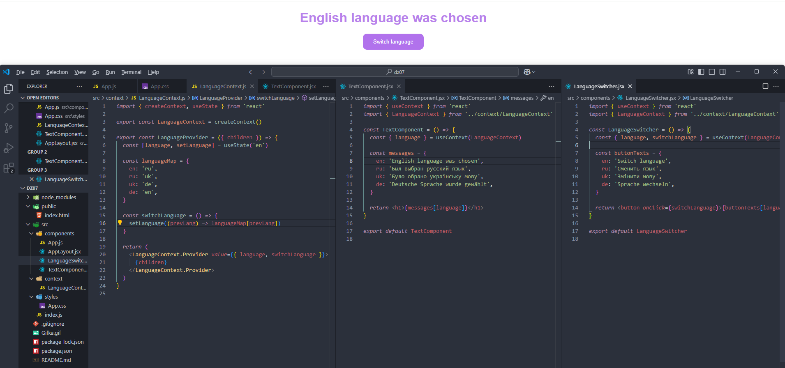

# React домашнее задание 7

## Задание 1: Создание React приложения с переключением языка при помощи контекста.

1. Создание нового React приложения

- Используйте инструмент для создания React приложений для начала разработки.

2. Создание контекста для управления языками

- Создайте контекст, который будет хранить текущий язык и функцию для его изменения.
- Используйте хук useState для управления состоянием текущего языка.
- Обеспечьте возможность доступа к текущему языку и функции изменения языка через провайдер.

3. Создание компонентов

- Компонент для переключения языка: Компонент с кнопкой, при нажатии на которую будет вызываться функция изменения языка.
- Текстовый компонент: Компонент, который отображает текст в зависимости от выбранного языка.
- Основной компонент: Компонент, который содержит в себе компонент для переключения языка и текстовый компонент.

4. Интеграция контекста в приложение

- Оберните ваше приложение в провайдер созданного контекста, чтобы все дочерние компоненты имели доступ к текущему языку и функции его изменения.

5. Тестирование функционала

- Проверьте, корректно ли работает переключение языков в приложении и правильно ли отображается текст на выбранном языке.

6. Стилизация приложения

- Придайте приятный вид вашему приложению при помощи CSS стилизации.

