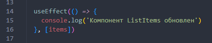
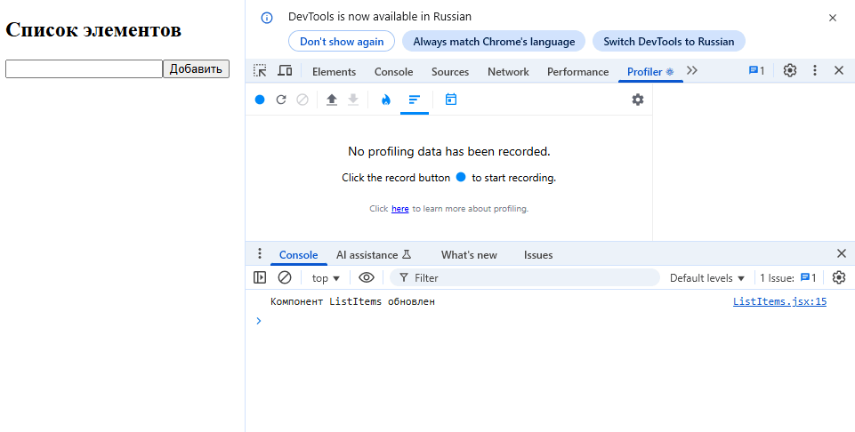
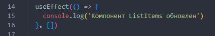
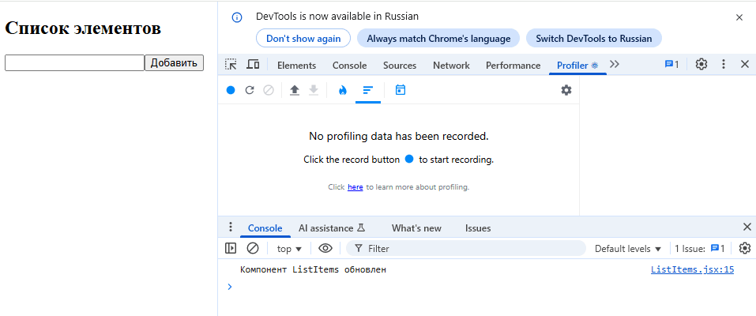
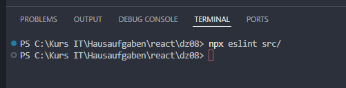
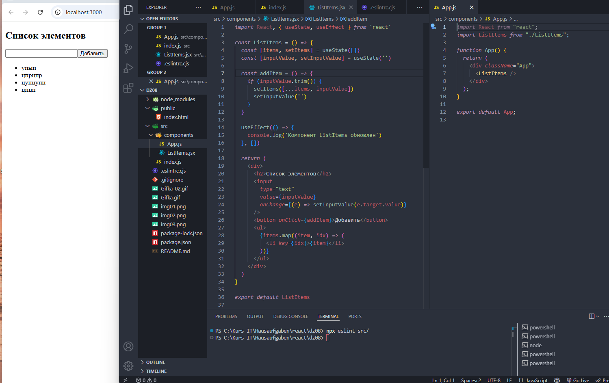

# React домашнее задание 8


## Задание 1: Практика знаний о DevTools, Eslint, написание приложения со списком.

1. Создание и настройка нового проекта React
- Создайте новый проект на React:
- Используйте `npx create-react-app performance-app` для создания нового проекта.
- Перейдите в созданную директорию проекта, используя `cd performance-app`.
- Настройка ESLint: Инициализируйте ESLint в проекте с помощью команды `npx eslint --init`.
- Следуйте инструкциям в консоли для выбора конфигурации ESLint, которая наилучшим образом подходит под ваш стиль работы.
- Убедитесь, что в проекте установлены все необходимые зависимости для работы ESLint.

2. Создание компонентов приложения
- Создание компонента для отображения списка элементов (ListItems.js):
- Определите функциональный компонент, который будет использовать состояния для управления списком элементов и текущим значением текстового поля:
- Используйте хук `useState` для создания переменных состояния `items` (массив, хранящий элементы списка) и `inputValue` (строковое значение текущего ввода пользователя).
- Реализуйте функцию `addItem`, которая добавляет текущее значение `inputValue` в массив `items` и очищает `inputValue`.
- Возвращаемый JSX должен включать текстовое поле для ввода, кнопку для добавления элемента в список и элемент `<ul>` для отображения элементов списка, каждый в своем `<li>`.
- Интеграция компонента в App.js:
- Откройте файл src/App.js.
- Импортируйте компонент ListItems в этот файл.
- Внутри функции App, возвращайте JSX, который содержит компонент ListItems.
- Сохраните файл и убедитесь, что приложение запускается без ошибок и новый компонент отображается на странице.

3. Внедрение намеренной ошибки
- Добавление намеренной ошибки в ListItems.js:
- В компоненте ListItems, внедрите использование хука `useEffect`, который будет выполнять некоторую функцию при каждом обновлении списка `items` `(console.log(‘компонент обновлен’))` .
- Установите в качестве зависимости useEffect массив items. Это вызовет выполнение функции внутри useEffect при каждом добавлении элемента в список, что намеренно создает избыточные вызовы и потенциальную переработку:
```
     useEffect(() => {
       console.log("Компонент ListItems обновлен");
     }, [items]);
```
- Этот код будет вызывать логирование в консоль при каждом изменении массива `items`, что можно наблюдать в консоли браузера при добавлении каждого нового элемента.

4. Тестирование и анализ производительности
- Запустите приложение: Используйте `npm start` для запуска приложения в режиме разработки.
- Использование React DevTools для анализа производительности: Откройте React DevTools в браузере.
- Начните используя DevTools, взаимодействуйте с приложением (например, добавляя элементы в список).
- Обратите внимание на частые перерисовки компонента и логи в консоли, что указывает на наличие излишних обновлений.





5. Исправление ошибки
- Модифицируйте `useEffect`:
- Измените зависимости `useEffect` таким образом, чтобы он вызывался только один раз при монтировании компонента (исключите список элементов из зависимостей).

6. Вторичное тестирование производительности
- Проведите повторное использование React DevTools.
- Убедитесь, что число перерисовок компонента сократилось и сообщения в консоль теперь выводятся только при начальном рендере.





7. Финализация и проверка кода
- Запустите ESLint для анализа исходного кода проекта, чтобы убедиться в отсутствии стилистических и логических ошибок.
- Исправьте все выявленные проблемы, следуя рекомендациям ESLint.







