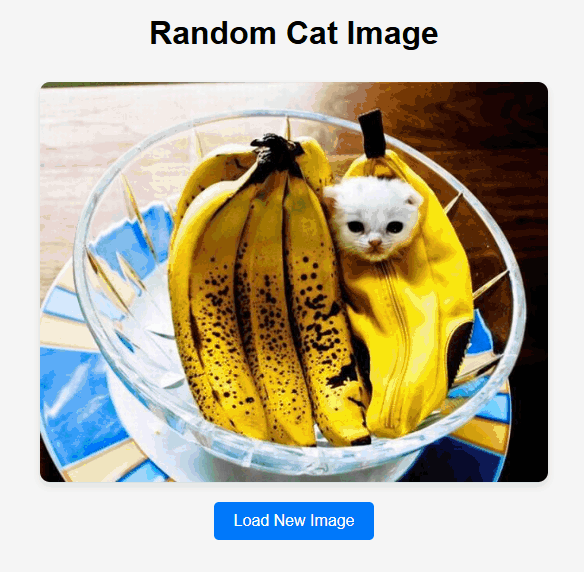
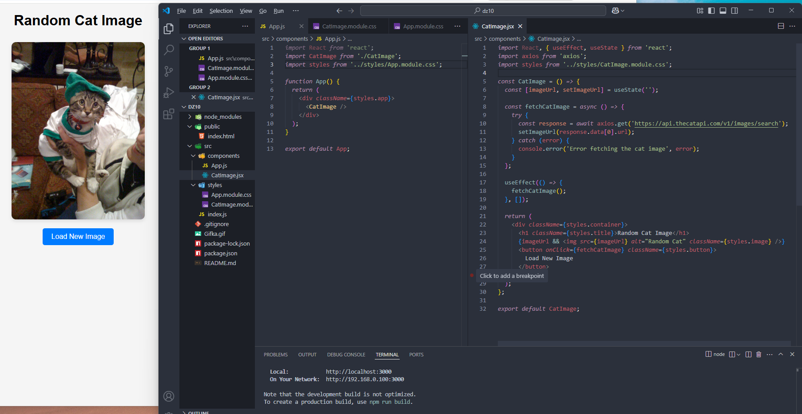

# React домашнее задание 10

## Задание 1: Создание React-приложения, которое отображает случайные картинки кошек, получая их с сервера.

Кошачий API: “https://api.thecatapi.com/v1/images/search”

1. Создание нового React-приложения:
- Создайте новое React-приложение с помощью Create React App.
- Установите axios для выполнения HTTP-запросов.

2. Создание компонента для отображения изображений кошек:
- Внутри папки `src` создайте папку `components` для хранения компонентов приложения.
- В папке `components` создайте файлы `CatImage.js` и `CatImage.module.css`.

3. Написание компонента `CatImage`:
- Импортируйте необходимые библиотеки: React, axios и модульные стили.
- Создайте функциональный компонент, который будет получать и отображать случайное изображение кошки.
- Используйте `useEffect` для загрузки изображения при монтировании компонента.
- Создайте кнопку для загрузки нового изображения по нажатию.

4. Добавление модульных стилей для компонента `CatImage`:
В файле `CatImage.module.css`:
- Создайте стили для контейнера, заголовка, изображения и кнопки.
- Определите стили для различных состояний кнопки, таких как `hover`.

5. Настройка основного компонента `App`:
- В папке `components` создайте файл стилей `App.module.css`.
В файле `App.js`:
- Импортируйте компонент `CatImage` и модульные стили.
- Создайте функциональный компонент, который будет использовать компонент `CatImage`.

6. Добавление модульных стилей для компонента `App`:
В файле `App.module.css`:
- Создайте стили для контейнера приложения, чтобы центрировать содержимое и задать фоновый цвет.

7. Запуск приложения:
- Запустите приложение с помощью команды: `npm start`
- Перейдите в браузере по адресу `http://localhost:3000`, чтобы увидеть ваше приложение.

