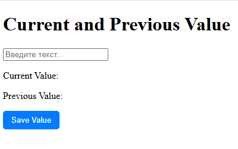
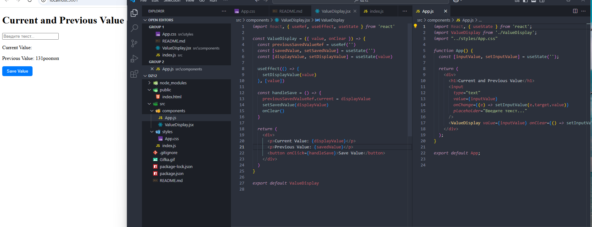

# React домашнее задание 12

## Задание 1: Создание приложения, отображающего текущее и предыдущее значения пропса.

1. Создайте новый React-проект
- Инициализируйте новый проект: Если у вас нет существующего проекта, создайте новый проект с помощью Create React App.

2. Настройка основного компонента приложения (App.js)
- Откройте файл `App.js` в папке `src`.
- Импортируйте необходимые библиотеки: Убедитесь, что вы импортировали `React` и `useState`.
- Создайте состояние для хранения значения: Используйте `useState` для создания состояния, которое будет обновляться при вводе текста в текстовое поле.
- Добавьте текстовое поле: Добавьте текстовое поле (`<input>`), которое будет обновлять состояние при изменении своего значения.
- Отобразите компонент `ValueDisplay`: Добавьте компонент `ValueDisplay`, передавая ему текущее значение как пропс.

3. Создание компонента для отображения текущего и предыдущего значения (ValueDisplay.js)
- Создайте новый файл `ValueDisplay.js` в папке `src`.
- Импортируйте необходимые библиотеки: Импортируйте `React`, `useRef` и `useEffect`.
- Создайте функциональный компонент: Определите компонент, который принимает пропс `value`.
- Создайте реф для хранения предыдущего значения: Используйте `useRef` для создания рефа, который будет сохранять предыдущее значение пропса.
- Обновите реф в `useEffect`: Используйте `useEffect` для обновления рефа каждый раз при изменении пропса `value`.
- Отобразите текущее и предыдущее значения: Внутри компонента отобразите текущее значение пропса и значение, сохраненное в рефе.

4. Добавьте стили
- Создайте файл стилей `App.css` (если его еще нет) в папке `src`.
- Определите базовые стили: Добавьте стили для выравнивания текста и оформления текстового поля и параграфов.
- Импортируйте стили в `App.js`: Импортируйте файл стилей в компонент `App.js`, чтобы применить стили ко всему приложению.

5. Запустите приложение
- Откройте терминал и перейдите в корневую папку проекта (если вы еще не там).
- Запустите приложение.

