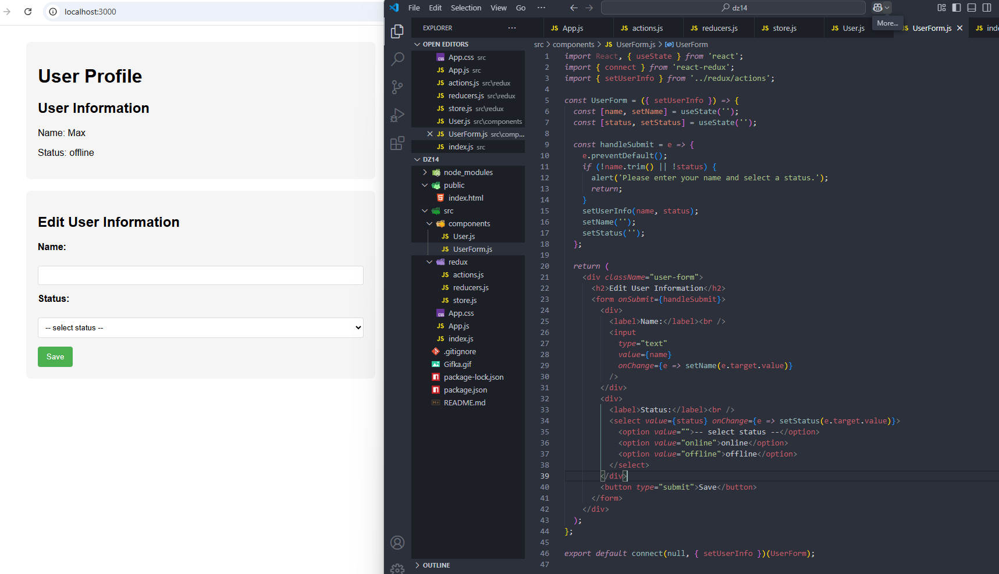

# React домашнее задание 14

## Задание 1: Создание приложения для управления состоянием пользователя с использованием React и Redux.

1. Создание проекта
- Создайте новый проект React.
- Установите Redux и React-Redux: npm install redux react-redux

2. Настройка Redux
- Создайте папку для Redux файлов:
- В корневой папке проекта создайте папку `redux` и внутри неё создайте файлы `store.js`, `actions.js` и `reducers.js`.
- Создание и настройка Redux store:
- В `store.js` импортируйте `createStore` из Redux.
- Импортируйте корневой редьюсер.
- Создайте и экспортируйте Redux store.
- Создание действий (actions):
- В `actions.js` определите тип действия (`SET_USER_INFO`).
- Создайте и экспортируйте функцию создателя действия (action creator) для обновления информации о пользователе (`setUserInfo`).
- Создание редьюсера (reducer):
- В `reducers.js` определите начальное состояние (initial state), содержащее имя и статус пользователя.
- Создайте и экспортируйте редьюсер для обработки действия обновления информации о пользователе.

3. Настройка компонентов React
- Создайте структуру компонентов:
- В корневой папке `src` создайте два файла: `User.js` и `UserForm.js`.
- Создание компонента User:
- Импортируйте необходимые модули из React и Redux.
- Создайте функциональный компонент `User`, который отображает имя и статус пользователя.
- Используйте функцию `connect` из `react-redux` для подключения компонента к Redux store.
- Определите функцию `mapStateToProps` для передачи состояния из Redux store в компоненты.
- Создание компонента UserForm:
- Импортируйте необходимые модули из React и Redux.
- Создайте функциональный компонент `UserForm`, который содержит форму для изменения имени и статуса пользователя.
- Определите локальные состояния для имени и статуса с помощью `useState`.
- Создайте обработчик отправки формы, который вызывает действие `setUserInfo`.
- Используйте функцию `connect` из `react-redux` для подключения компонента к Redux store.

4. Настройка основного компонента App
- Создайте и настройте главный компонент приложения:
- В `App.js` импортируйте компоненты `Provider` из `react-redux`, `store`, `User` и `UserForm`.
- Оберните компоненты `User` и `UserForm` в компонент `Provider` и передайте ему Redux store через prop `store`.

5. Тестирование и отладка
- Запустите приложение.
- Проверьте, что начальное состояние отображается правильно в компоненте `User`.**
- Измените имя и статус пользователя через форму в компоненте `UserForm` и убедитесь, что информация обновляется в компоненте `User`.**

6. Дополнительные улучшения
- Добавьте валидацию формы в компоненте `UserForm`.
- Стилизуйте компоненты для улучшения внешнего вида.

