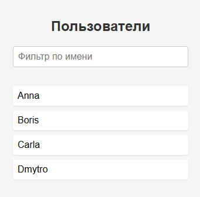
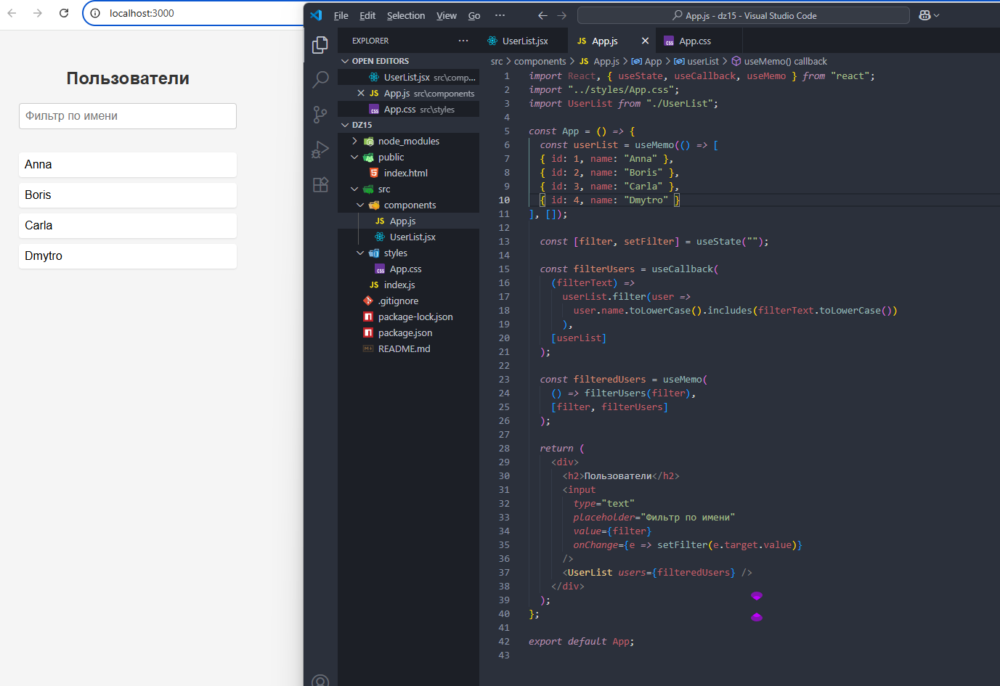

# React домашнее задание 15

## Задание 1: Оптимизация списка фильтрации.

1. Создание нового React-приложения:
- Создайте новый проект React или используйте существующий.

2. Создание компонента списка пользователей:
- Создайте функциональный компонент `UserList`, который будет отображать список пользователей.
- Принимайте в качестве пропса массив объектов пользователей.

3. Инициализация списка пользователей:
- Создайте массив объектов пользователей `userList` с несколькими пользователями. Каждый объект должен содержать поля `id` и `name`.

4. Создание состояния для фильтрации:
- Используйте хук `useState`, чтобы создать состояние `filter`, которое будет хранить текст фильтрации.

5. Функция фильтрации пользователей:
- Создайте функцию `filterUsers`, которая принимает текст фильтрации и возвращает отфильтрованный список пользователей.
- Функция должна фильтровать пользователей по имени, игнорируя регистр.

6. Мемоизация функции фильтрации:
- Мемоизируйте функцию `filterUsers` с помощью хука `useCallback`, чтобы она не пересоздавалась при каждом рендере.

7. Мемоизация отфильтрованного списка:
- Используйте хук `useMemo`, чтобы мемоизировать отфильтрованный список пользователей.
- Зависимостью `useMemo` должны быть состояние `filter` и функция `filterUsers`.

8. Разметка JSX:
- Создайте разметку JSX для приложения, включая поле ввода для фильтрации и компонент `UserList`.
- Передайте отфильтрованный список пользователей в компонент `UserList`.

9. Тестирование:
- Запустите ваше приложение и проверьте, что фильтрация пользователей работает корректно.
- Убедитесь, что список пользователей перерендеривается только при изменении текста фильтра.

