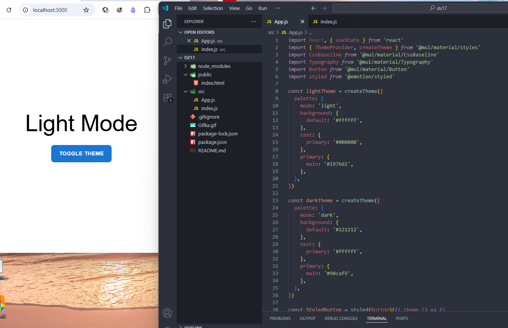

# React домашнее задание 16

## Задание 1: Приложение с переключением тем с использованием Material UI и Emotion.

1. Создание нового проекта React
- Откройте терминал и создайте новое React-приложение:
    `npx create-react-app theme-toggle-app`
- Перейдите в директорию проекта:
    `cd theme-toggle-app`

2. Установка необходимых зависимостей
- Установите Material UI и Emotion:
    `npm install @mui/material @emotion/react @emotion/styled`

3. Создание темы
- Откройте файл `App.js` в вашем текстовом редакторе.
- Импортируйте необходимые модули из Material UI для создания и предоставления темы:
    `ThemeProvider` для предоставления темы всему приложению.
    `createTheme` для создания кастомной темы.
    `CssBaseline` для нормализации базовых стилей по умолчанию.
- Создайте светлую и тёмную темы:
    Определите палитру цветов для светлой темы.
    Определите палитру цветов для тёмной темы.

4. Стилизация компонентов с помощью Emotion
- Импортируйте `styled` из Emotion.
- Создайте стилизованную кнопку:
    Определите стили для кнопки, такие как цвет фона, цвет текста, радиус границы и состояние при наведении.
- Используйте тему для получения цветов.

5. Создание функциональности для переключения темы
- Создайте функциональный компонент `App`.
- Используйте состояние (`useState`) для отслеживания текущего режима темы (светлый или тёмный).
- Создайте функцию для переключения между светлой и тёмной темой.

6. Рендеринг компонентов
- Оберните основной контент приложения в компонент `ThemeProvider`, передав ему текущую тему.
- Включите компонент `CssBaseline` для нормализации базовых стилей.
- Добавьте заголовок (`Typography`), который будет изменять текст в зависимости от текущей темы.
- Добавьте стилизованную кнопку, которая будет изменять тему при нажатии.

7. Запуск приложения
- Запустите приложение командой:
    `npm start`

